  <!-- Terminal Window / Header Graphic -->
  

    

  <!-- Contact & Social Badges -->
  
  
  
  

    

  <!-- Metric Badges -->
  
  
  
  
  

---

### 👤 About Me

* 🎓 **Education:** Undergraduate at the **National University of Singapore**, pursuing a Bachelor of Computing in **Information Security** with a Second Major in **Mathematics**.
* 📈 **Academic Standing:** Maintaining a strong GPA of **4.54 / 5.00**.
* 🔐 **Core Focus:** Deeply passionate about Penetration Testing, Network Security, Cryptography, Digital Forensics, and building AI-driven security automation tools.
* ⚡ **Beyond the Terminal:** Outside of capturing flags, you can find me proving mathematical concepts, cycling, jogging, or mentoring others.

---

### 💻 Codewars Stats

  

---

### 🛠 Technical Arsenal

| Category | Technologies / Topics |
| :--- | :--- |
| **Cybersecurity** | Network Security, Cryptography, Digital Forensics, Vulnerability Analysis |
| **Security Tools** | BurpSuite, Wireshark, GDB, ChromaDB, Whisper |
| **Programming** | Java, Python, C, C++, HTML, CSS, SQL |
| **Databases** | MySQL, PostgreSQL, SQLite, Tableau, Excel, Radiant |
| **Machine Learning** | LLM Prompt Engineering, XGBoost, RAG Pipelines |

---

### 💼 Work Experience

  

**Data Automation Engineer | Infineon Technologies Asia Pacific Pte Ltd** (Dec 2025 - Jun 2026)
* Architected a real-time alerting ecosystem featuring automated email fault-detection and custom Webex Bot notifications to instantly flag data run failures for over 20 scripts.
* Leveraged Large Language Models (LLMs) to automate log analysis, generating actionable troubleshooting summaries for over 20 different scripts.
* Engineered a predictive XGBoost machine learning model to automate root-cause exploration for electrical lot rejection rate (eLRR) spikes globally.
* Deployed data logging telemetry directly into production workflows to drastically reduce debugging times.

**Systems Deployment Facilitator | Accenture Private Limited** (Jun 2025 - Jul 2025)
* Expedited the rollout of the National Billing System (NBS) across Singapore.
* Collaborated with developers and analysts to triage and validate over 100 production bugs across 20+ healthcare clusters.
* Analyzed discrepancies between expected and actual billing outcomes, contributing to early detection of financial impact issues.

**Undergraduate Teaching Assistant | National University of Singapore** (Aug 2024 - Dec 2024)
* Taught over 40 undergraduate students on the basics of Computer Organisations, earning an outstanding teaching rating of **4.5 / 5.0**.

---

### 🚀 Highlighted Projects

**[AI-Powered Local Penetration Testing Assistant](https://github.com/cyrolite/vulnerability_ai_chatbot)**
* Built a local AI security assistant powered by a fine-tuned Mistral LLM, with a RAG pipeline over 250,000 CVE records using ChromaDB and sentence transformers.
* Implemented a voice interface using OpenAI Whisper (STT) and pyttsx3 (TTS) for hands-free security analysis.
* Deployed completely offline on local hardware with zero cloud dependencies to guarantee data privacy.

**[PassManager](https://cyrolite.pythonanywhere.com/)**
* Developed an online web application to securely store over 10,000 passwords with strict AES encryption and authentication.

**[Packet Sniffer](https://github.com/cyrolite/packet_sniffer)**
* Created a highly efficient application to sniff and capture thousands of live network packets, analyzing Ethernet, IP, TCP, and UDP details in real-time.

**[CollabSync](https://github.com/AY2425S2-CS2103T-F10-3/tp)**
* Led a 4-person software engineering team in a brownfield project to architect a functional address book system for NUS students using Agile sprints.

**[Scooby Chatbot](https://github.com/cyrolite/ip)**
* Created an offline local task chatbot with over 1,000 lines of functional and rigorous test code to track hundreds of tasks.

---

### 🚩 CTF & Cybersecurity Engagements

* **Acronis Capture the Flag (CTF)**: Led a 5-person team tackling advanced reverse engineering, cryptography, and network analysis challenges.
* **STANDCON Capture the Flag (CTF)**: Successfully competed by solving over 10 challenges in digital forensics, binary exploitation, and web vulnerabilities.

---

### 📜 Certifications & Additional Courses

* Computer Forensics Fundamentals
* Cryptography and Hashing Fundamentals in Python and Java
* The Complete SQL Bootcamp: Go from Zero To Hero
* Introduction to Machine Learning
* Getting Started with AWS Services Fundamentals for Beginners

---

> *"In a world of zero-days, be the patch."*
